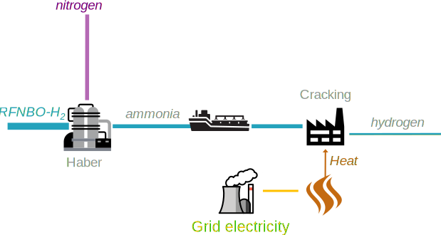

# R1: Relevant inputs

-   How to determine if an energy input is “relevant”

Cracking Ammonia is endothermic, the heat can be supplied externally or by burning part of the ammonia. Here we assume that the energy is supplied electrically.

## Assumptions

??? tip "Transports"
    For this example, the transport process has been oversimplified. In reality, emissions caused by the transport need to be taken into account. This includes emissions from the ship, charging, uncharging and all other intermediate processes, including upstream emissions of the energy inputs.

| Parameter                   |    Symbol          | Example value |
|----------------------------|:--------------:|:---------------------:|
|Hydrogen demand Haber process (ammonia production) | ${hydrogen}_{input}$ | $1.16\ \color{grey}{\left.MJ_{H_2}\middle/MJ_{{NH}_3}\right.}$ |
|Ammonia demand for cracking | ${ammonia}_{input}$ | $0.88\ \color{grey}{\left.MJ_{{NH}_3}\middle/MJ_{H_2}\right.}$ |
|Electricity demand Haber process | $el_{grid\_Haber}$ | $0.75\ \color{grey}{\left.MJ_{el}\middle/MJ_{{NH}_3}\right.}$ |
|Heat demand, cracking process | $heat_{cracking}$ | $0.05\ \color{grey}{\left.MJ\middle/MJ_{H_2}\right.}$ |
|Heat efficiency | $\eta_{heat}$ | $95\ \color{grey}{\%}$ |
|Hydrogen GHG intensity | $CI_{H_2}$ | $0\ \color{grey}{\left.g\,CO_2\,eq\middle/MJ_{H_2}\right.}$ |
|Grid GHG intensity | $CI_{grid}$ | $25\ \color{grey}{\left.g\,CO_2\,eq\middle/MJ_{el}\right.}$ |

As the output energy of the cracking process (1 MJ hydrogen) is bigger than the ammonia input (0.88 MJ), all the electricity used in the cracking process needs to be considered as a relevant input.

## Calculation

Total GHG intensity:

$$
\begin{aligned}
{E}_{H_2} &= (e_{i,elastic} + e_{i,rigid} - e_{ex-use}) + e_p + e_{td} + e_u - e_{ccs}
\\
e_{i,rigid},\ e_{ex-use},\ e_p,\ e_{td},\ e_u,\ e_{ccs} &&= 0\ \color{grey}{\left.g\,CO_2\,eq\middle/MJ_{hydrogen}\right.}
\\
e_{i,elastic,ammonia} &= {ammonia}_{input} \times \left(el_{grid\_Haber}  \times CI_{grid} + {hydrogen}_{input} \times CI_{H_2} \right) &\approx 16.5\ \color{grey}{\left.g\,CO_2\,eq\middle/MJ_{hydrogen}\right.}
\\
e_{i,elastic,heat} &= \frac{heat_{cracking} \times CI_{grid}}{\eta_{heat}} &\approx 1.3\ \color{grey}{\left.g\,CO_2\,eq\middle/MJ_{hydrogen}\right.}
\\
{E}_{H_2} &= e_{i,elastic,ammonia} + e_{i,elastic,heat} &\approx 17.8\ \color{grey}{\left.g\,CO_2\,eq\middle/MJ_{hydrogen}\right.}
\end{aligned}
$$

??? success "Threshold reached"
    The threshold of $28.2\ \color{grey}{\left.g\,CO_2\,eq\middle/MJ_{hydrogen}\right.}$ is met. We can declare the fuel as RFNBO (or low carbon fuel).

Share of RFNBO in the output is 

$$
Share_{RFNBO-H_{2}} = \frac{{ammonia}_{input}}{{ammonia}_{input} + heat_{cracking}} \approx 95\color{grey}{\%}
$$

The remainder is low-carbon fuel.

## Conclusion

This case study shows that some transport processes that need energy to split the transported product at destination might need to consider the energy needed for the split as relevant energy. If this energy is not fully renewable, the share of RFNBO will decrease.

One way to increase RFNBO share and lower the emissions is to use a part of the RFNBO ammonia to power the cracking process.

