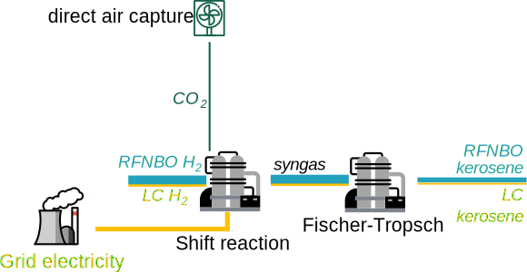

# R2: Integrated processes

-   How to count different integrated processes together

Hydrogen production as in [case study 2](H2-Time-averaging.md), shift with CO~2~ and subsequent Fischer Tropsch synthesis to kerosene, assuming only kerosene as output to simplify the example.

The shift reaction and Fischer Tropsch can be either seen as an integrated process, or as two separate processes. There could be differences in calcluating the share of RFNBO if when looking at them as seperate processes, on process increases the heating value, and thus the heating energy needs to be accounted as a relevant input.

According to the Q&A, the shift reaction and FT reaction should be considered as an integrated process.

## Assumptions

| Parameter                   |    Symbol          | Example value |
|----------------------------|:--------------:|:---------------------:|
|Amount of RFNBO hydrogen | ${prod}_{RFNBO-H_2}$ | $300\ \color{grey}{GJ}$ |
|Amount of LC hydrogen | ${prod}_{LC-H_2}$ | $30\ \color{grey}{GJ}$ |
|Hydrogen GHG intensity | ${CI}_{H2}$ | $14\ \color{grey}{\left.g\,CO_2\,eq\middle/MJ_{hydrogen}\right.}$ |
|Relevant grid electricity used for the shift reaction | $el_{grid\_shift}$ | $80\ \color{grey}{GJ}$ |
|Share of the (electric) heat energy ending up in the syngas | $Share_{heat\_to\_heating\_value}$ | $10\color{grey}{\%}$ |
|Efficiency of the shift reaction | $\eta_{shift}$ | $99\color{grey}{\%}$ |
|Shift reaction grid GHG intensity | $CI_{grid\_shift}$ | $5\ \color{grey}{\left.g\,CO_2\,eq\middle/MJ_{el}\right.}$ |
|Efficiency of the FT reaction | $\eta_{FT}$ | $70\color{grey}{\%}$ |

## Calculation

Energy coming out of the FT reaction: 
$${En}_{output} = \left({prod}_{H2} \times \eta_{shift} + el_{grid\_shift} \times Share_{heat\_to\_heating\_value} \right)  \times  \eta_{FT} = 234.3\ \color{grey}{GWh}
$$

This is lower than the hydrogen input, so the electricity does not have to be considered a relevant input.

Total GHG intensity: 

$$
{E}_{kerosene} = \frac{\left({prod}_{RFNBO-H_2} + {prod}_{LC-H_2} \right) \times {CI}_{H2} + el_{grid\_shift}  \times CI_{grid\_shift}}{{En}_{output}  \times  \eta_{FT}} \approx 21.4\ \color{grey}{\left.g\,CO_2\,eq\middle/MJ_{kerosene}\right.}
$$

??? success "Threshold reached"
    The threshold of $28.2\ \color{grey}{\left.g\,CO_2\,eq\middle/MJ_{hydrogen}\right.}$ is met. We can declare the fuel as RFNBO (or low carbon fuel).

Share of RFNBO in the output is 

$$
Share_{RFNBO- H2} = \frac{{prod}_{RFNBO-H_2}}{{prod}_{RFNBO-H_2} + {prod}_{LC-H_2}} \approx 91\color{grey}{\%}
$$

??? info "If looking only at the shift reaction"
    Energy coming out of the shift reaction: 

    $$
    {En}_{output} = \left({prod}_{RFNBO-H_2} + {prod}_{LC-H_2} \right) \times \eta_{shift} + el_{grid\_shift} \times Share_{heat\_to\_heating\_value} = 334.7\ \color{grey}{GJ}
    $$

    This is higher than the hydrogen input, so the electricity has to be considered a relevant input.

    Share of RFNBO in the output is 

    $$
    Share_{RFNBO-kerosene} = \frac{{prod}_{RFNBO-H_2}}{{prod}_{RFNBO-H_2} + {prod}_{LC-H_2} + el_{grid\_shift}} \approx 73\color{grey}{\%}
    $$

    Total GHG intensity as before:

    $$
    {E}_{kerosene} \approx 27.7\ \color{grey}{\left.g\,CO_2\,eq\middle/MJ_{kerosene}\right.}
    $$

## Conclusion

This case study shows that if looking at the processes separately, under certain circumstances it is possible that the energy content is increased, and that the electricity has to be counted as relevant input. In this case, the share of RFNBO in the output changes, but the GHG intensity remains the same.

