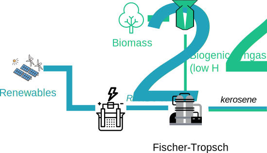

# R3: Biofuels and RFNBO co-production

-   How to split biogenic and RFNBO-parts

Instead of using a shift reaction to increase the H~2~/CO ratio in biogenic syngas, RFNBO hydrogen is added to the Fischer-Tropsch process. According to the “co-processing exception” in Annex A point 1, a distinction on a proportional basis of the energetic value of inputs shall be made.

As clarified in the [Q&A document](https://circabc.europa.eu/ui/group/8f5f9424-a7ef-4dbf-b914-1af1d12ff5d2/library/ca8efd4d-cb44-4aec-914d-3d95f95ea293/details), the process can be split using the share of RFNBO hydrogen in overall hydrogen input to determine the share of all products going into the part of the process following the RFNBO GHG methodology.

## Assumptions

| Parameter                   |    Symbol          | Example value |
|----------------------------|:--------------:|:-----------------------:|
|H2:CO ratio of biogenic syngas | $r_{bio}$ | $1:1$ |
|Molar ratio of biogenic syngas to RFNBO hydrogen | $r_{sh}$ | $1:1$ |
|(H2:CO ratio for FT reaction | $r_{FT}$ | $3:1$ )|
|Molar LHV hydrogen | $lhv_{H_2}$ | $244\ \color{grey}{\left.MJ\middle/kmol\right.}$ |
|Molar LHV CO | $lhv_{CO}$ | $283\ \color{grey}{\left.MJ\middle/kmol\right.}$ |
|Efficiency of the FT reaction | $\eta_{FT}$ | $70\color{grey}{\%}$ |
|RFNBO hydrogen GHG intensity | $CI_{H_2}$ | $5\ \color{grey}{\left.g\,CO_2\,eq\middle/MJ_{el}\right.}$ |
|Biogenic syngas GHG intensity | $CI_{bio\_syngas}$ | $20\ \color{grey}{\left.g\,CO_2\,eq\middle/MJ_{syngas}\right.}$ |

## Calculation

Energy in 1 kmol of syngas: $En_{syngas} =  263.5\ \color{grey}{\left.MJ\middle/kmol\right.}$

Energy in 1 kmol of hydrogen: $En_{H_2} =  283\ \color{grey}{\left.MJ\middle/kmol\right.}$

Energy share of RFNBO in the inputs: $s_{RFNBO} = \frac{En_{H_2}}{En_{syngas} + En_{H_2}} \approx 51.8 \color{grey}{\%}$

This share will be used to split the process: all RFNBO hydrogen and 51.8% of the CO will go into the process part calculated according to the RFNBO GHG methodology.

To simplify the example, we assume no process emissions. $e_u$ determined from emission factor.

Total GHG intensity:

$$
\begin{aligned}
{E}_{RFNBO-kerosene} &= \left(e_{i,elastic} + e_{i,rigid} - e_{ex-use}\right) + e_p + e_{td} + e_u - e_{ccs}
\\
e_{i,rigid},\ e_p,\ e_{td},\ e_{ccs} &&= 0\ \color{grey}{\left.g\,CO_2\,eq\middle/MJ_{hydrogen}\right.}
\\
e_{i,elastic} &= \frac{r_{FT} \times CI_{H_2} + CI_{bio\_syngas}}{\left(r_{FT} + 1\right) \times \eta_{FT}} &\approx 12.5\ \color{grey}{\left.g\,CO_2\,eq\middle/MJ_{kerosene}\right.}
\\
e_u &&= 68.2\ \color{grey}{\left.g\,CO_2\,eq\middle/MJ_{kerosene}\right.}
\\
e_{ex-use} &&= 68.2\ \color{grey}{\left.g\,CO_2\,eq\middle/MJ_{kerosene}\right.}
\\
{E}_{RFNBO-kerosene} &= \frac{CI_{ren}}{\eta_{FT}} &= 0\ \color{grey}{\left.g\,CO_2\,eq\middle/MJ_{kerosene}\right.}
\end{aligned}
$$

Ex-use is attributed because the carbon going into the RFNBO-kerosene is not fossil (see [Q&A document](https://circabc.europa.eu/ui/group/8f5f9424-a7ef-4dbf-b914-1af1d12ff5d2/library/ca8efd4d-cb44-4aec-914d-3d95f95ea293/details))

$$
\begin{aligned}
{E}_{bio-kerosene} &= \frac{CI_{bio\_syngas}}{\eta_{FT}} = \ 28.6\ \color{grey}{\left.g\,CO_2\,eq\middle/MJ_{kerosene}\right.}
\end{aligned}
$$

??? success "Threshold reached for RFNBO"
    The threshold of $28.2\ \color{grey}{\left.g\,CO_2\,eq\middle/MJ_{hydrogen}\right.}$ is met. We can declare the fuel as RFNBO (or low carbon fuel). Different thresholds apply for the biofuel.

Share in the output (see above): 

$$
\begin{aligned}
Share_{RFNBO-kerosene} &= 51.8\color{grey}{\%} \\
Share_{bio-kerosene} &= 48.2\color{grey}{\%}
\end{aligned}
$$

## Conclusion

This case study shows that the streams are separated based on the energy in the inputs, and then the GHG intensity is calculated for each stream separately.

