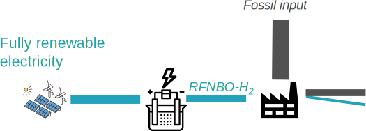

# R4: Partly replacing fossil inputs

-   How to split RFNBO part from fossil inputs in existing fossil processes

Very similar to the [biogenic syngas case](#r3-biofuels-and-rfnbo-co-production), the fossil process part can be virtually split from the RFNBO part. Here, we show a case of coal gasification and Fischer Tropsch synthesis, but this could be applied to other fossil transformation processes.

??? tip "Allocation to Fischer Tropsch co-products"
    It is not possible to freely allocate the RFNBO share to one of the co-products, for example kerosene. All FT products contain the same share of RFNBO.

## Assumptions

| Parameter                   |    Symbol          | Example value |
|----------------------------|:--------------:|:-----------------------:|
|Energy ratio of syngas to hydrogen | $r_{sh}$ | $9\ \color{grey}{\left.MJ_{syngas}\middle/MJ_{hydrogen}\right.}$ |
|Efficiency of the FT reaction | $\eta_{FT}$ | $70\color{grey}{\%}$ |
|Fully renewable electricity GHG intensity | $CI_{ren}$ | $0\ \color{grey}{\left.g\,CO_2\,eq\middle/MJ_{el}\right.}$ |
|Fossil syngas GHG intensity | $CI_{syngas}$ | $120\ \color{grey}{\left.g\,CO_2\,eq\middle/MJ_{syngas}\right.}$ |

## Calculation

Total GHG intensity: 

$$
\begin{aligned}
{E}_{RFNBO-kerosene} &= 0\ \color{grey}{\left.g\,CO_2\,eq\middle/MJ_{kerosene}\right.} \\
{E}_{fossil-kerosene} &= \frac{CI_{syngas}}{\eta_{FT}} = 171.4\ \color{grey}{\left.g\,CO_2\,eq\middle/MJ_{kerosene}\right.}
\end{aligned}
$$

??? success "Threshold reached for RFNBO"
    The threshold of $28.2\ \color{grey}{\left.g\,CO_2\,eq\middle/MJ_{hydrogen}\right.}$ is met. We can declare the fuel as RFNBO (or low carbon fuel). The impact of the fossil process remains as before.

Share of RFNBO in the output is $Share_{RFNBO-kerosene} = \frac{1}{1 + r_{sh}} = 10\color{grey}{\%}$

## Conclusion

Even if the fossil part doesn’t respect the 70% GHG reduction, the energetic share of RFNBO in the inputs can still be virtually split from the process and the corresponding output can be declared as RFNBO.

