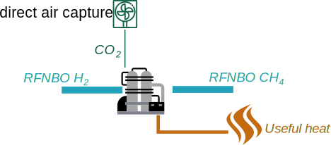

# R5: Allocation to co-produced heat

-   How to allocate e_ex_use to co-products that don't contain carbon

In this virtual case, the sum of all emissions that should be allocated between the product (methane) and the useful heat is negative because of the e$_{ex-use}$ credit for CO$_2$ included in e$_i$. Allocating negative emissions to heat may be undesired. The reply to question 50 of the guidance document allows for allocation according to the same rules as set out for biofuels in Annex V to the RED.

## Assumptions

| Parameter                   |    Symbol          | Example value |
|----------------------------|:--------------:|:-----------------------:|
|GHG intensity of hydrogen | $e_{hydrogen}$ | $8\ \color{grey}{\left.g\,CO_2\,eq\middle/MJ_{methane}\right.}$ |
|GHG intensity of CO$_2$ | $e_{CO_2}$ | $1\ \color{grey}{\left.g\,CO_2\,eq\middle/MJ_{methane}\right.}$ |
|Ex-use for CO$_2$ | $e_{ex-use}$ | $10\ \color{grey}{\left.g\,CO_2\,eq\middle/MJ_{methane}\right.}$ |
|Heat production efficiency | $\eta_{heat}$ | $99\ \color{grey}{\%}$ |
|Energy ratio of useful heat to methane | $r_{hm}$ | $0.1\ \color{grey}{\left.MJ_{useful\ heat}\middle/MJ_{methane}\right.}$ |

## Calculation

Emissions to be allocated don't include e_u:

$$
\begin{aligned}
{E}_{products} &= \left(e_{i,elastic} + e_{i,rigid} - e_{ex-use}\right) + e_p + e_{td} - e_{ccs}
\\
e_{i,rigid},\ e_{p},\ e_{td},\ e_{ccs} &&= 0\ \color{grey}{\left.g\,CO_2\,eq\middle/MJ_{methane}\right.}
\\
e_{i,elastic} &= e_{hydrogen} + e_{CO_2} &= 9\ \color{grey}{\left.g\,CO_2\,eq\middle/MJ_{methane}\right.}
\\
{E}_{products} &= e_{i,elastic} - e_{ex-use} &= -1\ \color{grey}{\left.g\,CO_2\,eq\middle/MJ_{methane}\right.}
\end{aligned}
$$

With normal energy allocation, this gives:

$$
\begin{aligned}
{E}_{heat}  &= \frac{{E}_{products}}{1 + r_{hm}} &= -0.9\ \color{grey}{\left.g\,CO_2\,eq\middle/MJ_{product}\right.}
\\
{E}_{methane} &= \frac{{E}_{products}}{1 + r_{hm}} + e_u &= 9.1\ \color{grey}{\left.g\,CO_2\,eq\middle/MJ_{product}\right.}
\end{aligned}
$$

RED II Annex V part C point 17 allows: ...The greenhouse gas intensity of excess useful heat or excess electricity is the same as the greenhouse gas intensity of heat or electricity delivered to the fuel production process...

The heat needed for the process comes entirely from the hydrogen, so:

$$
\begin{aligned}
{E}_{heat} &= \frac{e_{hydrogen}}{\eta_{heat}} &\approx 8.1\ \color{grey}{\left.g\,CO_2\,eq\middle/MJ_{useful\ heat}\right.}
\\
{E}_{methane} &= {E}_{products} - {E}_{heat} \times r_{hm} + e_u &\approx 8.2\ \color{grey}{\left.g\,CO_2\,eq\middle/MJ_{useful\ heat}\right.}
\end{aligned}
$$

??? success "Threshold reached for RFNBO"
    The threshold of $28.2\ \color{grey}{\left.g\,CO_2\,eq\middle/MJ_{hydrogen}\right.}$ is met. We can declare the fuel as RFNBO (or low carbon fuel).

## Conclusion

Negative emissions from e_ex-use should not be allocated to products that don't contain carbon (and thus don't have combustion emissions), as negative emissions don't make physical sense.

