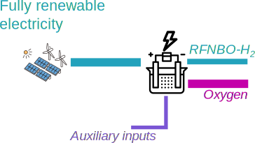
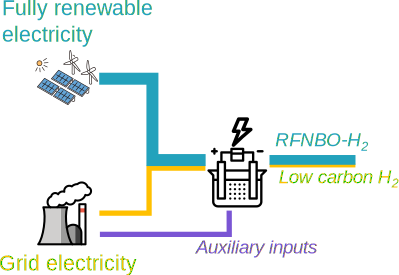
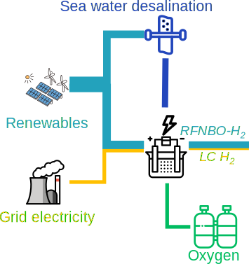

---
hide:
  - toc
---

# Overview

!!! abstract "What is the purpose of this site?"

    This document was created to help to understand how the calculation of carbon intensity and share of RFNBO and RCF should be implemented. Each case study focuses on one element that might be unclear. The last case study shows a more complex and realistic case.

??? info "Legal notes"

    This document was created to help stakeholders understand and think about the GHG calculation methodology for RCF and RFNBO. It should not be considered as representative of the European Commission’s official position and does not involve the European Commission in liability of any kind.

    Icons that have been used to generate the images:

    * <a href="https://soco-st.com/?ref=svgrepo.com" target="_blank">Soco St</a> in CC Attribution License via <a href="https://www.svgrepo.com/" target="_blank">SVG Repo</a>
    * <a href="https://github.com/hfg-gmuend/openmoji/blob/master/LICENSE.txt?ref=svgrepo.com" target="_blank">Openmoji.org</a> in CC Attribution License via <a href="https://www.svgrepo.com/" target="_blank">SVG Repo</a>
    * <a href="https://www.freepik.com/icon/electrolysis_1055133#fromView=search&page=1&position=3&uuid=cdbda609-d7e1-4a45-8c3e-5f4a5922115e">Icon by Freepik</a>
    * Refinery: https://www.svgrepo.com/svg/424697/factory-illustration-industry-3
    * Tree: <a href="https://www.pixelbazaar.com/goodie/responsive-icons?ref=svgrepo.com" target="_blank">Pixelbazaar</a> in CC Attribution License via <a href="https://www.svgrepo.com/" target="_blank">SVG Repo</a>
    * Biogenic power plant: https://www.pngrepo.com/svg/133519/power-plant, https://www.svgrepo.com/svg/474743/biomass, Vectors and icons by <a href="https://github.com/neuicons/neu?ref=svgrepo.com" target="_blank">Neuicons</a> in MIT License via <a href="https://www.svgrepo.com/" target="_blank">SVG Repo</a>
    * Tanker: https://www.iconfinder.com/icons/4047319/gas_oil_ship_tank_tanker_icon
    * Factory: <a href="https://github.com/etn-ccis/blui-icons?ref=svgrepo.com" target="_blank">Etn Ccis</a> in MIT License via <a href="https://www.svgrepo.com/" target="_blank">SVG Repo</a>
    * Heat: <a href="https://github.com/nagoshiashumari/Rpg-Awesome?ref=svgrepo.com" target="_blank">Nagoshiashumari</a> in GPL License via <a href="https://www.svgrepo.com/" target="_blank">SVG Repo</a>
    * Plane: <a href="https://icooon-mono.com/?ref=svgrepo.com" target="_blank">Icooon Mono</a> in PD License via <a href="https://www.svgrepo.com/" target="_blank">SVG Repo</a>
    * Truck: <a href="https://www.onlinewebfonts.com/icon">svg icons</a>is licensed by CC BY 4.0
    * Direct air capture: https://www.svgrepo.com/svg/265869/ventilator-cool
    * Desalination: <a href="https://dribbble.com/Tima_R?ref=svgrepo.com" target="_blank">Timofei Rostilov</a> in CC Attribution License via <a href="https://www.svgrepo.com/" target="_blank">SVG Repo</a>
    * Oxygen tank: https://www.svgrepo.com/svg/285543/oxygen-tank
    

-   <a href="./RFNBO case studies/H1-Co-products">
    __H1: Co-products__

    ---    
    
    ---
    * How to allocate emissions to oxygen
    * How to calculate the share of RFNBO with emissions from auxiliaries
    </a>

-   <a href="./RFNBO case studies/H2-Time-averaging">
    __H2: Time averaging__

    ---    
    
    ---
    * How to average over different timeframes
    </a>

-   <a href="./RFNBO case studies/H3-Hydrogen-full-example" >
    :bulb: __H3: Full hydrogen example__ :bulb:

    ---    
    
    ---
    * System boundaries
    * Where to find more information
    </a>

-   <a href="./RFNBO case studies/R1-Relevant-inputs">
    __R1: Relevant inputs__

    ---    
    
    ---    
    * How to determine if an energy input is “relevant”
    </a>

-   <a href="./RFNBO case studies/R2-Integrated-processes">
    __R2: Integrated processes__

    ---    
    
    ---
    * How to count different integrated processes together
    </a>

-   <a href="./RFNBO case studies/R3-Biofuels-and-RFNBO-co-production">
    __R3: Biofuels and RFNBO co-production__

    ---    
    
    ---
    * How to split biogenic and RFNBO-parts
    </a>

-   <a href="./RFNBO case studies/r4-Partly-replacing-fossil-inputs">
    __R4: Partly replacing fossil inputs__

    ---    
    
    ---
    * How to split RFNBO part from fossil inputs in existing fossil processes
    </a>

-   <a href="./RFNBO case studies/R5-Allocation-to-co-produced-heat">
    __R5: Allocation to co-produced heat__

    ---    
    
    ---
    * How to allocate e_ex_use to co-products without carbon
    </a>

-   <a href="./RFNBO case studies/R6-Full-example">
    :bulb: __R6: Full hydrogen to liquid example__ :bulb:

    ---    
    
    ---
    * How to combine the previous examples and where to find additional information.
    </a>